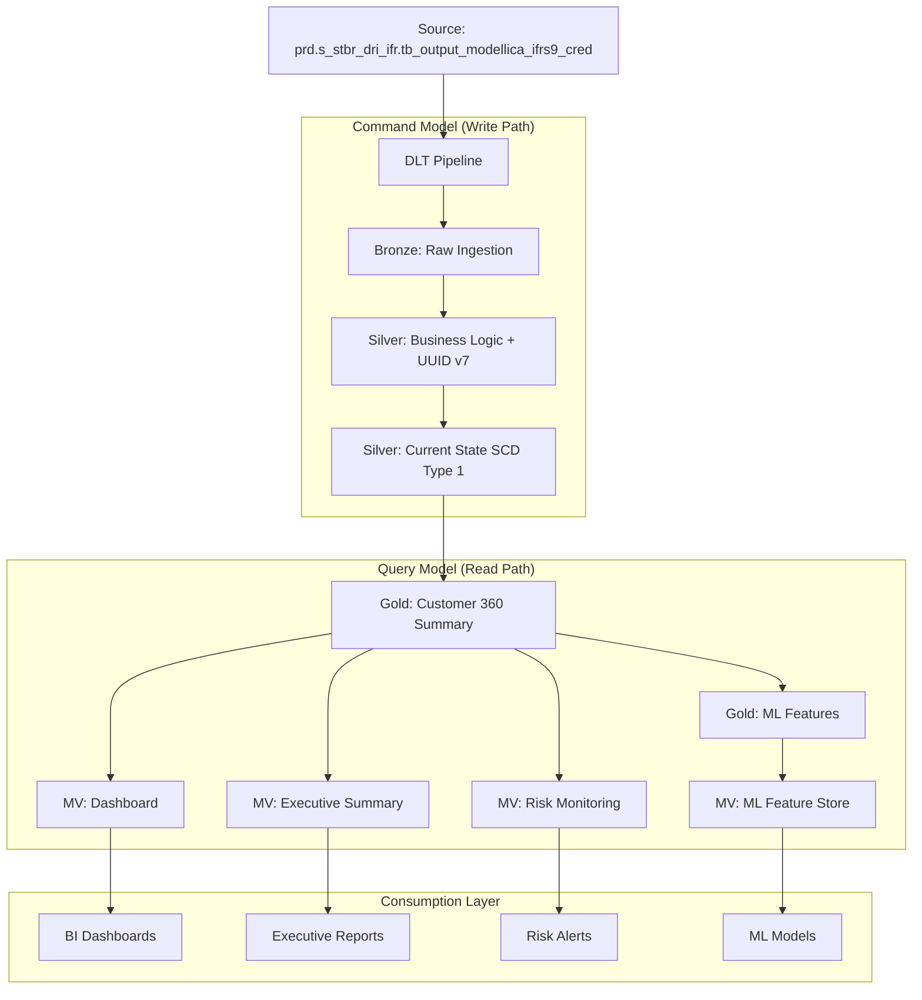

# Customer 360 CQRS Architecture Implementation Guide

## Overview

This implementation provides a high-performance Customer 360 platform using the CQRS (Command Query Responsibility Segregation) pattern on Databricks Lakehouse. The solution streams data from the existing table `prd.s_stbr_dri_ifr.tb_output_modellica_ifrs9_cred` and processes it through a modern data architecture optimized for both transactional integrity and analytical performance.

## Architecture Components

### 1. CQRS Command Model (Write Path)
- **Bronze Layer**: Raw data ingestion with Change Data Capture (CDC)
- **Silver Layer**: Business logic transformations and UUID v7 generation
- **State Management**: SCD Type 1 using `APPLY CHANGES INTO`

### 2. CQRS Query Model (Read Path)
- **Gold Layer**: Denormalized views optimized for analytics
- **Materialized Views**: Pre-computed aggregations for dashboards
- **ML Feature Store**: Time-series features for predictive modeling

### 3. Key Technologies
- **UUID v7**: Time-ordered identifiers for optimal indexing
- **Delta Live Tables (DLT)**: Declarative pipeline framework
- **Unity Catalog**: Governance and data lineage
- **Materialized Views**: Low-latency query serving

## Files Included

### 1. `databricks_cqrs_customer360_dlt_pipeline.py`
The main Delta Live Tables pipeline implementing the CQRS Command model:

- **UUID v7 UDF**: Generates time-ordered globally unique identifiers
- **Bronze Layer**: Streams from source Delta table with data quality checks
- **Silver Layer**: Applies business transformations and generates UUID v7
- **Gold Layer**: Creates aggregated views for analytics
- **ML Features**: Prepares features for machine learning models

### 2. `databricks_cqrs_materialized_views.sql`
SQL scripts for implementing the CQRS Query model:

- **Dashboard MV**: Hourly refresh for real-time dashboards
- **Executive Summary MV**: Daily refresh for executive reporting
- **Risk Monitoring MV**: 4-hour refresh for risk alerts
- **ML Feature Store MV**: Daily refresh for model training

## Implementation Steps

### Step 1: Deploy the Delta Live Tables Pipeline

1. **Create a new DLT Pipeline in Databricks**:
   ```
   Pipeline Name: customer-360-cqrs-ifrs9
   Source Code: databricks_cqrs_customer360_dlt_pipeline.py
   Target Schema: prd.sand_crc_estudos_ifrs9
   Pipeline Mode: Triggered or Continuous
   ```

2. **Configure Pipeline Settings**:
   - Cluster Configuration: Enable auto-scaling
   - Advanced Settings: 
     ```json
     {
       "pipelines.trigger.interval": "1 hour",
       "spark.databricks.delta.optimizeWrite.enabled": "true",
       "spark.databricks.delta.autoCompact.enabled": "true"
     }
     ```

3. **Set Environment Variables** (if needed):
   ```
   SOURCE_TABLE=prd.s_stbr_dri_ifr.tb_output_modellica_ifrs9_cred
   TARGET_SCHEMA=prd.sand_crc_estudos_ifrs9
   ```

### Step 2: Deploy Materialized Views

1. **Run the SQL scripts** in Databricks SQL:
   ```sql
   -- Execute databricks_cqrs_materialized_views.sql
   -- This will create all materialized views with appropriate refresh schedules
   ```

2. **Verify Materialized View Creation**:
   ```sql
   SHOW MATERIALIZED VIEWS IN prd.sand_crc_estudos_ifrs9;
   ```

### Step 3: Set Up Governance and Monitoring

1. **Enable Unity Catalog Features**:
   - Data lineage tracking
   - Column-level permissions
   - Data classification tags

2. **Configure Monitoring**:
   - Set up alerts for pipeline failures
   - Monitor data freshness
   - Track query performance

## Data Flow Architecture



## Key Features Implemented

### 1. UUID v7 for Optimal Performance
- **Time-ordered**: Ensures sequential writes for better Delta Lake performance
- **Globally unique**: No coordination needed across distributed systems
- **Indexing friendly**: Optimal for Z-ORDER optimization

### 2. Data Quality Framework
- **Expectations**: Built-in data quality checks at each layer
- **Monitoring**: Automated tracking of data quality metrics
- **Alerting**: Proactive notifications for data issues

### 3. Change Data Capture (CDC)
- **APPLY CHANGES INTO**: Handles inserts, updates, and deletes
- **Sequence management**: Handles out-of-order events
- **SCD Type 1**: Maintains current state efficiently

### 4. ML-Ready Features
- **Time-series features**: Rolling averages, volatility measures
- **Change features**: Trend analysis and growth metrics
- **Lifecycle features**: Customer tenure and segmentation

## Performance Optimizations

### 1. Storage Optimizations
```sql
-- Z-ORDER optimization for common query patterns
OPTIMIZE prd.sand_crc_estudos_ifrs9.gold_customer_360_summary 
ZORDER BY (customer_id, business_date);
```

### 2. Materialized View Strategies
- **Refresh Schedules**: Optimized based on business requirements
- **Partitioning**: Date-based partitioning for efficient queries
- **Aggregation Levels**: Pre-computed at appropriate granularity

### 3. Caching Strategies
```python
# Enable delta caching for frequently accessed tables
spark.conf.set("spark.databricks.io.cache.enabled", "true")
```

## Monitoring and Maintenance

### 1. Pipeline Health Monitoring
```sql
-- Check pipeline status
SELECT * FROM prd.sand_crc_estudos_ifrs9.data_quality_metrics
ORDER BY check_timestamp DESC LIMIT 10;
```

### 2. Data Freshness Monitoring
```sql
-- Monitor data freshness
SELECT 
  table_name,
  max_data_age_hours,
  CASE 
    WHEN max_data_age_hours < 2 THEN 'Excellent'
    WHEN max_data_age_hours < 6 THEN 'Good'
    WHEN max_data_age_hours < 24 THEN 'Acceptable'
    ELSE 'Needs Attention'
  END as freshness_status
FROM prd.sand_crc_estudos_ifrs9.mv_executive_summary
WHERE business_date = current_date();
```

### 3. Performance Monitoring
```sql
-- Query performance tracking
SELECT 
  query_text,
  execution_time_ms,
  rows_scanned,
  bytes_scanned
FROM system.query.history
WHERE schema_name = 'prd.sand_crc_estudos_ifrs9'
ORDER BY execution_time_ms DESC;
```

## Business Benefits

### 1. Scalability
- **Independent scaling**: Read and write workloads scale independently
- **Auto-optimization**: Delta Lake handles file management automatically
- **Elastic compute**: Databricks provides automatic scaling

### 2. Performance
- **Sub-second queries**: Materialized views provide instant dashboard responses
- **Optimized storage**: UUID v7 and Z-ORDER optimization maximize performance
- **Parallel processing**: Spark distributes workload across cluster

### 3. Reliability
- **ACID transactions**: Delta Lake ensures data consistency
- **Automatic retries**: DLT handles transient failures automatically
- **Data quality**: Built-in expectations prevent bad data propagation

### 4. Governance
- **Data lineage**: Full traceability from source to consumption
- **Access control**: Fine-grained permissions via Unity Catalog
- **Audit trails**: Complete history of data transformations

## Troubleshooting Guide

### Common Issues and Solutions

1. **Pipeline Failure**:
   ```bash
   # Check pipeline logs
   databricks pipelines get-events --pipeline-id <pipeline_id>
   ```

2. **Data Quality Issues**:
   ```sql
   -- Check expectation failures
   SELECT * FROM prd.sand_crc_estudos_ifrs9.data_quality_metrics
   WHERE bronze_to_silver_ratio < 0.95;
   ```

3. **Performance Issues**:
   ```sql
   -- Analyze table statistics
   DESCRIBE DETAIL prd.sand_crc_estudos_ifrs9.gold_customer_360_summary;
   ```

## Next Steps

1. **Enhance ML Features**: Add more sophisticated feature engineering
2. **Real-time Processing**: Implement streaming analytics for real-time insights
3. **Advanced Analytics**: Integrate with MLflow for model lifecycle management
4. **External Integration**: Connect to downstream systems via Delta Sharing

## Support and Documentation

- **Databricks Documentation**: [Delta Live Tables Guide](https://docs.databricks.com/delta-live-tables/index.html)
- **Unity Catalog**: [Governance Framework](https://docs.databricks.com/data-governance/unity-catalog/index.html)
- **Best Practices**: [Lakehouse Architecture](https://docs.databricks.com/lakehouse/index.html)